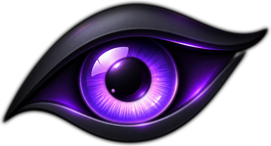

  

<h1 align="center">prettyeyes</h1>

Скриншоты с пометками, размытием и закреплением поверх окон.

Windows 10 / 11 · x64 · Русский интерфейс · Бесплатно

<table>
  <tr>
    <td align="center">
      <h3><a href="https://prettyeyes.fun/#demo">Попробовать в браузере →</a></h3>
      
На <a href="https://prettyeyes.fun/">prettyeyes.fun</a> можно порисовать в редакторе, размыть часть кадра, добавить надпись и попробовать закрепление. Всё прямо на странице, без установки.

    </td>
  </tr>
</table>

  <a href="https://github.com/zxczxczxczxczxczxc1111/prettyeyes/releases/latest"><strong>Скачать для Windows</strong></a> ·
  <a href="https://prettyeyes.fun/#log">Что нового</a> ·
  <a href="https://github.com/zxczxczxczxczxczxc1111/prettyeyes/issues">Сообщить об ошибке</a>

## Что умеет

<table>
  <tr>
    <td width="50%"><strong>Область или весь монитор</strong> Выделяй нужный фрагмент, в том числе на стыке экранов. Или снимай монитор под курсором одной комбинацией.</td>
    <td width="50%"><strong>Пометки на снимке</strong> Стрелки, линии, рамки, карандаш, маркер, текст и эмодзи. Личные данные можно скрыть размытием.</td>
  </tr>
  <tr>
    <td><strong>Закрепление поверх окон</strong> Держи перед глазами фрагмент переписки, пример или номер ошибки. Меняй масштаб и прозрачность, рисуй прямо в закреплённом окне.</td>
    <td><strong>Оформление при сохранении</strong> Добавляй фон, поля, скругления и тень. Копируй результат в буфер или сохраняй в PNG.</td>
  </tr>
  <tr>
    <td><strong>Лупа и цвет под курсором</strong> Выделяй область с точностью до пикселя. Смотри код цвета под лупой и копируй его клавишей C.</td>
    <td><strong>Настройки под себя</strong> Выбирай горячие клавиши, инструменты на панели и вид курсора. Настрой папку быстрого сохранения и запуск вместе с Windows.</td>
  </tr>
</table>

## Первый снимок

1. Скачай установщик из [последнего релиза](https://github.com/zxczxczxczxczxczxc1111/prettyeyes/releases/latest) и запусти prettyeyes. Значок появится в трее.
2. Нажми **Alt + PrtScn** и выдели область мышью.
3. Добавь пометки, если нужно. **Ctrl + C** скопирует снимок, **Ctrl + S** сохранит его в файл.

Чтобы снять весь монитор под курсором, нажми **Ctrl + PrtScn**. В настройках можно включить сохранение каждого скопированного снимка в выбранную папку.

Установка для текущего пользователя, без прав администратора. Аккаунт не нужен, .NET отдельно устанавливать не требуется.

Установщик не подписан сертификатом разработчика, поэтому Windows может показать предупреждение. SHA-256 для проверки файла указан в описании релиза.

## Под рукой

<strong>Горячие клавиши и работа с объектами</strong>

| Комбинация | Действие |
|---|---|
| `Alt + PrtScn` | Выделить область |
| `Ctrl + PrtScn` | Скопировать монитор под курсором |
| `Ctrl + C` | Скопировать снимок |
| `Ctrl + S` | Сохранить PNG с выбором папки |
| `Ctrl + Z` | Отменить последний объект |
| `C` | Скопировать цвет под лупой |
| Стрелки / `Shift` + стрелки | Сдвинуть выделение на 1 / 10 пикселей |
| `Ctrl` + перетаскивание | Перенести объект |
| `Ctrl` или `Alt` + колесо | Изменить размер объекта под курсором |
| `Esc` | Закрыть карточку инструмента, затем инструмент, затем выделение |

Правая кнопка на инструменте открывает его настройки. Там меняются цвет и толщина; у стрелки можно выбрать прямую линию или рисование от руки.

В закреплённом окне колесо меняет масштаб, `Ctrl` + колесо меняет прозрачность, `Alt` + колесо меняет размер объекта. Перемещать окно можно правой кнопкой мыши или с зажатым `Space`. Если внутри есть пометки, `Esc` не закроет окно, а при закрытии крестиком появится подтверждение.

Горячие клавиши меняются в настройках. Там же можно назначить сочетания для закрепления снимка, скрытия и показа всех закреплённых окон. Одиночная буква, назначенная глобальной горячей клавишей, перестанет печататься в других программах; предупреждение об этом находится рядом с полем.

<strong>Сборка из исходников</strong>

Понадобятся Windows и .NET SDK 10. Для установщика нужен Inno Setup 6.

Из корня репозитория:

1. `dotnet build` собирает приложение.
2. `dotnet test` запускает тесты.
3. `.\build.ps1` собирает самодостаточное приложение и установщик в `dist/`.

`.\build.ps1 -Check` собирает отдельную проверочную версию со своими настройками и иконкой. Её можно поставить рядом с обычной; проверка обновлений в ней отключена.

Стек: C# / .NET 10, Avalonia, SkiaSharp, xUnit, Inno Setup.

---

Нашёл ошибку или хочешь предложить функцию? [Напиши в Issues](https://github.com/zxczxczxczxczxczxc1111/prettyeyes/issues).

Эмодзи: [Twemoji](https://github.com/jdecked/twemoji), лицензия CC-BY 4.0. Emoji artwork by Twitter, Inc and other contributors.
