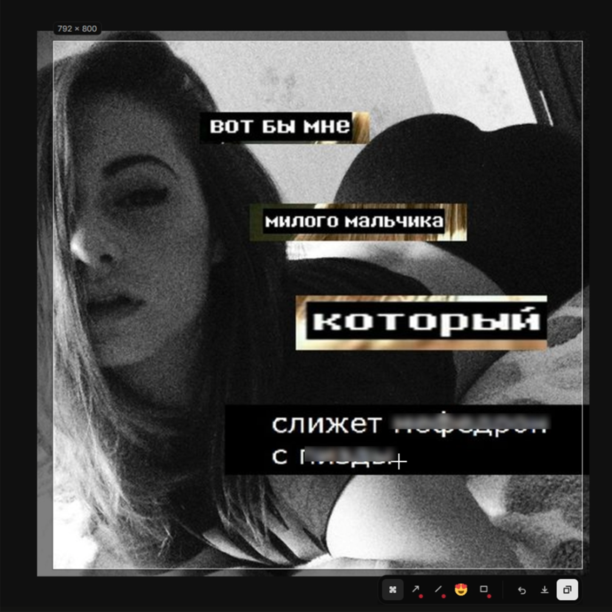

# prettyeyes

Скриншотер для Windows: горячая клавиша, замирающий экран, выделение области,
размытие и пометки, копирование в буфер или сохранение в файл.



## Что умеет

- **Выделение области.** Экран замирает и затемняется, рамка тянется через
  границу мониторов. Готовую рамку можно двигать и растягивать за края.
- **Инструменты.** Размытие, стрелка, линия, рамка, эмодзи. Размытие берёт
  пиксели из исходного кадра, поэтому два перекрывающихся пятна не превращаются
  в кашу. Правая кнопка на инструменте открывает цвет и толщину. Состав панели
  настраивается: лишнее убирается с глаз.
- **Лупа.** Увеличение под курсором с сеткой пикселей и кодом цвета. `C`
  копирует цвет под перекрестием. Режимы: без лупы, лупа, лупа с сеткой.
- **Эмодзи.** Сорок глифов, размер задаётся протяжкой. Поставленный эмодзи
  переносится протяжкой с зажатым `Ctrl`.
- **Вывод.** Копирование в буфер обмена или сохранение в PNG. В буфер кладутся
  и PNG, и DIB, так что вставка работает и в браузере, и в редакторах.
- **Быстрое сохранение.** Каждый скопированный скриншот сразу ложится файлом в
  выбранную папку, без диалога и уведомлений. Имя файла собирается по шаблону.
- **Оформление при выводе.** Поля, фон, скругление и тень вокруг скриншота -
  включается отдельно, превью рисуется тем же кодом, что и сам файл.
- **Скриншот монитора.** Отдельная комбинация снимает монитор под курсором сразу
  в буфер, без оверлея.
- **Обновления.** Приложение само проверяет релизы и ставит новую версию:
  установщик скачивается только с проверкой размера и SHA-256.
- **Трей.** Приложение живёт в трее, комбинации и автозапуск настраиваются.

## Горячие клавиши

| Комбинация | Действие |
|------------|----------|
| `Ctrl + Shift + 4` | выделить область |
| `Ctrl + Shift + 3` | монитор под курсором в буфер |
| `Ctrl + C` | скопировать в буфер |
| `Ctrl + S` | сохранить в файл, с `Shift` - через диалог |
| `Ctrl + Z` | отменить последний объект |
| `C` | скопировать цвет под лупой |
| стрелки | сдвинуть выделение на пиксель, с `Shift` - на десять |
| `Ctrl` + протяжка | перенести поставленный эмодзи |
| `Esc` | закрыть карточку, затем инструмент, затем оверлей |

Обе комбинации меняются в настройках: подойдёт почти любая клавиша, включая
`PrtScn`, `Alt + End`, стрелки, цифровой блок и F1-F24. Без модификатора можно
назначить только те клавиши, которыми не набирают текст: `PrtScn`, `Pause`,
`Insert`, F-ряд и мультимедийные. По умолчанию выбран не `PrtScn`, потому что на
Windows 11 его может перехватывать «Ножницы».

## Установка

Установщик лежит в [релизах](../../releases): ставится для текущего
пользователя, без прав администратора, в `%LOCALAPPDATA%\Programs\prettyeyes`.

### Предупреждение при установке

При запуске установщика Windows покажет окно «Windows защитила ваш
компьютер». Это личный проект и не имеет публичной лицензии, поэтому
предупреждение появляется.

## Сборка из исходников

Нужен .NET SDK 10 и, для установщика, Inno Setup 6.

```powershell
dotnet build
dotnet test
.\build.ps1
```

`build.ps1` публикует самодостаточный exe и собирает установщик в `dist\`.

## Устройство

Четыре проекта. Граница проведена так, чтобы логику можно было тестировать без
окон и без Windows.

| Проект | Содержимое |
|--------|------------|
| `PrettyEyes.Core` | модель документа, инструменты, геометрия выделения, рендер. Ни одной ссылки на UI и WinAPI |
| `PrettyEyes.Platform.Windows` | захват экрана, горячие клавиши, трей, буфер обмена, автозапуск |
| `PrettyEyes.App` | Avalonia: оверлей, панель инструментов, настройки, токены стилей |
| `PrettyEyes.Core.Tests` | юнит-тесты на Core |

Захват идёт через `Windows.Graphics.Capture` с откатом на GDI: первый видит
окна с аппаратным ускорением, второй не требует от системы ничего, кроме
`BitBlt`.

## Авторство

Набор эмодзи - [Twemoji](https://github.com/jdecked/twemoji), лицензия CC-BY 4.0.
Emoji artwork by Twitter, Inc and other contributors.

## Стек

C# / .NET 10, Avalonia 11.3, SkiaSharp 3.116, xUnit, Inno Setup 6.
